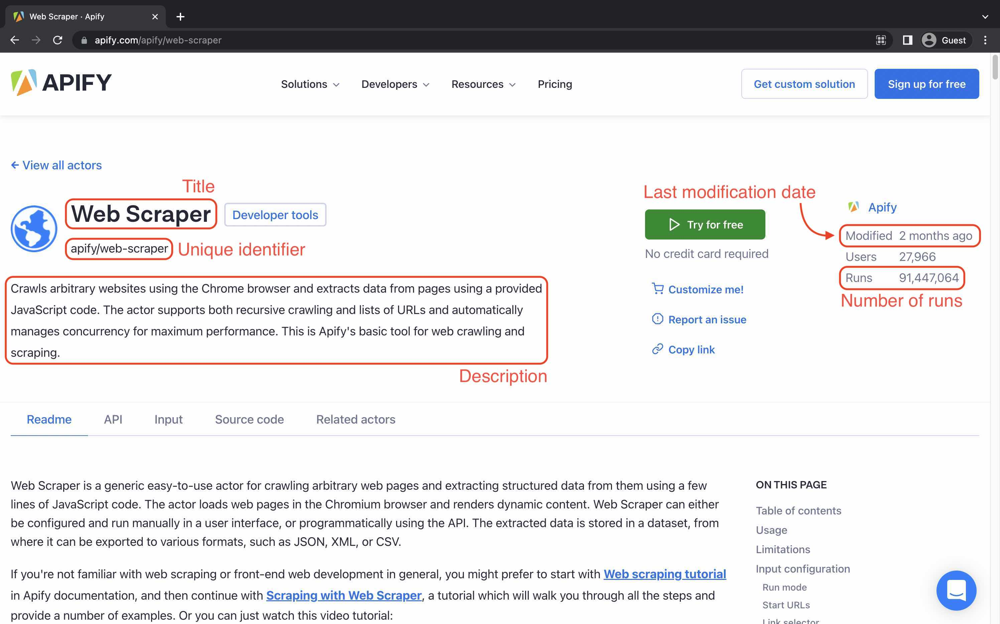

# [Getting some real-world data](https://crawlee.dev/docs/introduction/real-world-project)

```sh
crawling.sh job tutorial 03
log-last.sh tutorial 03
```

## 03 튜토리얼 목표

- `Apify Store`(https://apify.com/store)를 크롤링하는 예제.
  - `Actor`를 스크랩
- `JavaScript Rendering`이 포함됨.

<br>

### 크롤링 프로세스 (반복)

1. 페이지에서 새로운 링크 탐색
2. domain을 가리키는 항목 필터링
3. [`RequestQueue`](https://crawlee.dev/api/core/function/enqueueLinks)에 추가

<br>

### `사전 조사`

: 크롤링/스크래이핑을 시작하기 전. 간단한 사전 조사가 필요함.

- [ ] 웹사이트의 구성
- [ ] HTTP 요청으로만 스크랩 가능한지 (`CheerioCrawler`)
- [ ] Headless 브라우저가 필요한지
- [ ] 크롤링 방지 장치가 있는지
- [ ] HTML을 구문 분석해야하는지/API로 직접 가져올 수 있는지

---

03 튜토리얼에서는 다음과 같이 설정함.

- [x] `CheerioCrawler`로 스크래이핑 불가능 --> `PlaywrightCrawler`로 동작
- [x] Headless 브라우저가 필요한지

<br>

### `크롤링 대상 데이터 정의`

: 스크랩하려는 데이터와 그 위치를 찾아야 함.

---

03 튜토리얼에서는 다음 데이터를 목표로 함.

1. URL
2. Owner
3. Unique identifier
4. Title
5. Description
6. `Last modification date`
7. `Number of runs`



: 6(`Last modification date`), 7(`Number of runs`)은 세부 페이지로 한 번 더 이동해야 확인 가능

<br>

### `시작 URL 찾기`

: 추출할 데이터를 가장 쉽게 찾을 수 있는 페이지를 시작 URL로 설정해야 함

---

03 튜토리얼에서는 다음 페이지를 `시작 URL`로 함 -> `apify.com/store`

<br>

### `페이지 구성`

: pagination 절차 등을 확인해야 함

   https://apify.com/store?page=2

<br>

### `크롤링 구성`

1. 시작 URL 설정
2. 추가적으로 방문해야 하는 페이지(세부정보) 대기열 추가
3. 다음 페이지 대기열 추가
4. 대기열에서 request 처리 시작 시
   1. 목록페이지면 다음 페이지로 이동
   2. 상세 페이지면 데이터 스크랩
5. 반복

<br>

### `크롤러 사전 테스트`

: 스크래이핑을 시작하기 전, 웹사이트에 대해 동작을 하는지 사전 테스트가 필요함.

아래 예를 통해, 액터 카드의 텍스트 콘텐츠를 뽑는 크롤러를 테스트.

```js
// Instead of CheerioCrawler let's use Playwright
// to be able to render JavaScript.
import { PlaywrightCrawler } from 'crawlee';

const crawler = new PlaywrightCrawler({
    requestHandler: async ({ page }) => {
        // Wait for the actor cards to render.
        await page.waitForSelector('.ActorStoreItem');
        // Execute a function in the browser which targets
        // the actor card elements and allows their manipulation.
        const actorTexts = await page.$$eval('.ActorStoreItem', (els) => {
            // Extract text content from the actor cards
            return els.map((el) => el.textContent);
        });
        actorTexts.forEach((text, i) => {
            console.log(`ACTOR_${i + 1}: ${text}\n`);
        });
    },
});

await crawler.run(['https://apify.com/store']);
```

또는 Cheerio 파싱으로 아래처럼 구성할 수도 있음.

```js
// Instead of CheerioCrawler let's use Playwright
// to be able to render JavaScript.
import { PlaywrightCrawler } from 'crawlee';

const crawler = new PlaywrightCrawler({
    requestHandler: async ({ page, parseWithCheerio }) => {
        // Wait for the actor cards to render.
        await page.waitForSelector('.ActorStoreItem');
        // Extract the page's HTML from browser
        // and parse it with Cheerio.
        const $ = await parseWithCheerio();
        // Use familiar Cheerio syntax to
        // select all the actor cards.
        $('.ActorStoreItem').each((i, el) => {
            const text = $(el).text();
            console.log(`ACTOR_${i + 1}: ${text}\n`);
        });
    },
});

await crawler.run(['https://apify.com/store']);
```

<br>

### 결과

```sh

```
